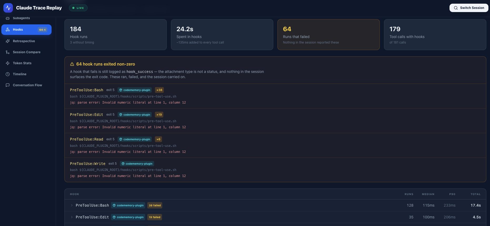

# Claude Trace Replay

[English](./README.md) | [简体中文](./README.zh-CN.md)

<p align="center">
  <strong>Open-source trace viewer and observability workspace for Claude Code.</strong>
</p>

<p align="center">
  Replay Claude Code <code>.jsonl</code> sessions, inspect agent flows and tool calls, spot token spikes, compare runs, and understand what actually happened.
</p>

<p align="center">
  <a href="https://github.com/harrylettering/claude-trace-replay/stargazers">Star on GitHub</a>
  ·
  <a href="#demo">Watch Demo</a>
  ·
  <a href="#quick-start">Quick Start</a>
  ·
  <a href="#use-cases">Use Cases</a>
  ·
  <a href="#feature-highlights">Feature Highlights</a>
  ·
  <a href="#screenshots">Screenshots</a>
  ·
  <a href="#who-its-for">Who It's For</a>
</p>

<p align="center">
  <a href="https://github.com/harrylettering/claude-trace-replay/stargazers"></a>
  
  
  
  
</p>

<a id="demo"></a>

## Demo

Watch the 4-minute product demo:

https://github.com/user-attachments/assets/be7374a6-5f6a-4c87-95f5-defe3974f6ea

## Short Pitch

Claude Trace Replay is an open-source Claude Code trace viewer that turns raw `.jsonl` sessions into a replayable workspace for debugging, observability, and prompt iteration.

## Why People Star This

Most Claude Code traces are technically rich and visually painful to review.

Claude Trace Replay turns raw session logs into a visual replay and debugging workspace so you can:

- See what the agent actually did, in order
- Understand which tool calls consumed time, tokens, and attention
- Replay agent-to-tool handoffs instead of reading raw event blocks
- Compare two sessions to learn what changed between prompts, models, or workflows
- Follow work the session handed to subagents, instead of losing it at "agent launched"
- Review prompt quality and collaboration patterns after a run

If you use Claude Code seriously, this helps you move from "I captured a trace" to "I know what happened."

## Use Cases

- **Debug noisy agent runs**: find the exact turn where the workflow slowed down, looped, or drifted off-task
- **Inspect tool behavior**: trace file reads, diffs, terminal commands, and tool results in execution order
- **Review token usage**: identify expensive turns and sudden spikes before they become routine
- **Compare prompt or model changes**: see why one Claude Code session performed better than another
- **Share learnings with a team**: turn raw traces into something people can review together

## Feature Highlights

- **Agent Flow — Canvas**: watch the call graph animate step by step around the main agent
- **Agent Flow — Trace**: the same run as a table of cycles, laid out on real elapsed time, with every cycle's payload, result, hops and timing inspectable
- **Subagent observability**: agents dispatched with the Task tool get their own transcripts read, linked back to the cycle that launched them, and expandable inline in the Trace
- **Live watch**: point the local server at `~/.claude/projects` and a running session streams in as it is written — including transcripts of agents dispatched mid-session
- **Searchable Timeline**: browse tool calls, thoughts, diffs, file reads, terminal commands, and results, with filters for entry type, tool, time range and token range
- **Token Analytics**: input, output and — since prompt caching carries almost all of a long session's input — cached tokens, counted once per API response rather than once per log entry
- **Session Compare**: diff two runs across messages, tokens, tools, and models
- **AI Retrospective**: surface strengths, weaknesses, and next-step improvements by handing a compressed trace to your local Claude CLI

## Who It's For

- Developers debugging noisy Claude Code sessions
- People reviewing long agent runs with many tools
- Teams trying to understand why one prompt or workflow worked better than another
- Anyone who wants to learn from real AI coding traces instead of guessing
## Screenshots

### Finding a session

Sessions in `~/.claude/projects` are discovered automatically. A card marked
`1 AGENT` dispatched a subagent, so there is a transcript to open alongside it.


### Agent Flow — Canvas

One cycle at a time: the model requests, the harness dispatches, the tool
returns, the result feeds back. The panel names the hop you are on and what
comes next.

| Tool result returning to the agent | A file edit mid-flight |
| --- | --- |
|  |  |

### Agent Flow — Trace

The same run as a table. Three tracks across the top place every cycle on real
elapsed time; `Turns` and `Calls` control how much of the run is folded away.
Selecting a cycle opens its payload, result, hops and timing.

| Every cycle, scaled by duration | Collapsed to turns and replies |
| --- | --- |
|  |  |

### Subagents

Work handed to another agent, followed all the way through: what it was asked,
what it did, what it cost, and what came back. A dispatch row in the Trace
expands into that agent's own trace, inspected through the same panel.

| The Subagents view | A dispatch expanded inline in the Trace |
| --- | --- |
|  |  |

### Hooks

Commands the harness runs around your work, and what they cost. A PreToolUse
hook is paid once per matching call, so a slow one shows up as a slow tool with
nothing to say otherwise. Failures are called out because nothing else reports
them: a hook that exits non-zero is still logged as `hook_success`, so only the
exit code says what happened.



### Session intelligence

| Session Overview | Token Usage |
| --- | --- |
|  |  |

| Timeline, with the retrospective panel | Session Compare |
| --- | --- |
|  |  |

## Quick Start

Bring your own Claude Code `.jsonl` trace and open it locally in a few minutes.

### Requirements

- Node.js 20.19+ — `chokidar` 5, which powers the live watch, requires it. CI builds on Node 22.
- npm

### Install

```bash
git clone https://github.com/harrylettering/claude-trace-replay.git
cd claude-trace-replay
npm install
```

### Run

```bash
./start.sh
```

Open `http://localhost:3000`.

`start.sh` starts two processes: the Vite dev server on port 3000, and a local
watcher (`server.cjs`) on port 4000. The watcher is what scans
`~/.claude/projects` for recent sessions, streams a live one as it is written,
and shells out to your local `claude` CLI for the Retrospective view. Nothing
leaves your machine, and the frontend works without the watcher if you upload a
`.jsonl` file by hand — you just lose discovery and live watch.

### Build

```bash
npm run build
```

### Preview Production Build

```bash
npm run preview
```

## First Run

1. Open the app locally.
2. Load a Claude Code `.jsonl` trace.
3. Jump between timeline, token, flow, compare, and analysis views.
4. Find the exact step where the run slowed down, got noisy, or went off track.

Tip: if you plan to share the project, recording a short before/after comparison with a real trace usually explains the value faster than static screenshots alone.

## Workspace Views

These are the entries in the left-hand nav, in order.

| View | What You Learn |
| --- | --- |
| Agent Flow | Two tabs over one timeline: **Canvas** animates the handoffs between user, main agent, assistant and tools; **Trace** lists every cycle on real elapsed time and lets you inspect one |
| Session Overview | High-level stats for tokens, messages, models, duration, and tools |
| Subagents | What each dispatched agent was asked, what it did, how long it ran, what it cost, and what it returned |
| Retrospective | AI retrospective and prompt-quality review, produced by your local Claude CLI |
| Session Compare | What changed between two runs |
| Token Stats | Spikes, expensive turns, and usage trends |
| Timeline | Chronological actions, tool usage, diffs, and results |

## Why It Exists

Claude Code sessions can become long, tool-heavy, and hard to audit from raw trace data alone.

This project exists to make those sessions reviewable:

- for debugging
- for performance tuning
- for prompt iteration
- for agent workflow learning
- for sharing and comparing runs with others

## Supported Trace Data

Claude Trace Replay is built around Claude Code `.jsonl` session traces.

Typical entry types include:

- `user`
- `assistant`
- `system`
- tool-use and tool-result content blocks
- permission and metadata events
- file history snapshots

Common fields used by the parser include:

- `uuid`
- `parentUuid`
- `timestamp`
- `type`
- `message` — including `message.id`, which identifies the API response an entry
  came from. One response is written as one entry per content block, all sharing
  that id and each repeating the same `usage`, so anything that sums per-response
  data has to group by it.
- `isSidechain`
- `isMeta`
- `agentId` / `attributionAgent` — present on subagent transcripts
- `toolUseResult` — carries the `agentId` of a dispatched agent, which is what
  links a Task cycle to the run it started

### Subagent transcripts

An agent dispatched with the Task tool writes its own file, one level below the
session it belongs to:

```text
~/.claude/projects/<project>/<sessionId>/subagents/agent-<agentId>.jsonl
```

Those entries are a separate conversation with their own root, so they are kept
out of the session's own entry list and attributed to their agent by `agentId`.
Discovery finds them, live watch streams them, and the Subagents and Trace views
read them. A session file opened on its own still shows that a dispatch happened
— it just has no transcript to expand, and says so.

## Tech Stack

Frontend:

- React 18, TypeScript 5, Vite 5
- Tailwind CSS 3
- Recharts, XYFlow / React Flow, Framer Motion
- Lucide React, react-markdown, react-diff-viewer-continued
- Zustand, html2canvas

Local watcher (`server.cjs`):

- Express 5 and `ws` — discovery over HTTP, log streaming over WebSocket
- chokidar 5 — file watching

The Agent Flow canvas is drawn with the Canvas 2D API rather than a graph
library; React Flow is used elsewhere.

## Project Structure

```text
claude-trace-replay/
├── .github/workflows/ci.yml  # Type-check and build on every pull request
├── docs/
│   └── screenshots/          # README media and product visuals
├── src/
│   ├── components/
│   │   ├── AgentFlowView/    # Canvas + Trace: graph building, playback, inspector
│   │   └── ...               # Overview, Subagents, Timeline, Compare, Retrospective
│   ├── hooks/                # Playback and interaction hooks
│   ├── types/                # Domain types
│   ├── utils/                # Trace parsing, analysis, and helper logic
│   ├── App.tsx               # Application shell and nav
│   ├── main.tsx              # Entry point
│   └── index.css             # Global styling
├── server.cjs                # Local watcher: discovery, live streaming, CLI analysis
├── start.sh                  # Starts the watcher and the dev server together
├── package.json
└── README.md
```

## Development

```bash
npm run dev       # Start the Vite development server (frontend only)
npm run build     # Type-check and build for production
npm run preview   # Preview the production build locally
node server.cjs   # Start the watcher on its own, on port 4000
```

`npm run lint` is defined but does not currently run: the repo has ESLint
installed with no configuration file, so the command exits with
`couldn't find a configuration file`. CI runs `npm ci && npm run build` — a full
type-check and build — on every pull request. Adding an ESLint config is a
good first contribution.

### Verifying parser changes

The parser is the part of this project most likely to be silently wrong, because
a wrong number still renders. When changing it, compute the expected value
independently — straight from the raw `.jsonl`, by a different route than the
code under test — and compare. Deriving the expectation the same way the code
does proves only that you are consistently wrong; that has happened here, and it
is documented in the commit history.

## Roadmap

- Add anonymized sample traces so first-time users can explore instantly
- Draw dispatched subagents on the Agent Flow canvas — it needs a second agent
  lane, so today they are visible in Trace and the Subagents view but not on the
  canvas
- Virtualize the remaining unbounded lists
- Add an ESLint configuration so `npm run lint` works, and put it in CI
- Surface failure, retry and repeat-command signals as findings rather than
  leaving them to be spotted by eye
- Add export presets for reports and retrospectives

## Contributing

Contributions are welcome.

Good contribution areas:

- parser improvements
- UI polish
- performance work for large traces
- new analysis panels
- sample datasets and reproducible bug cases

If this project helped you understand Claude Code sessions faster, a GitHub Star really helps other people find it.

## License

MIT
