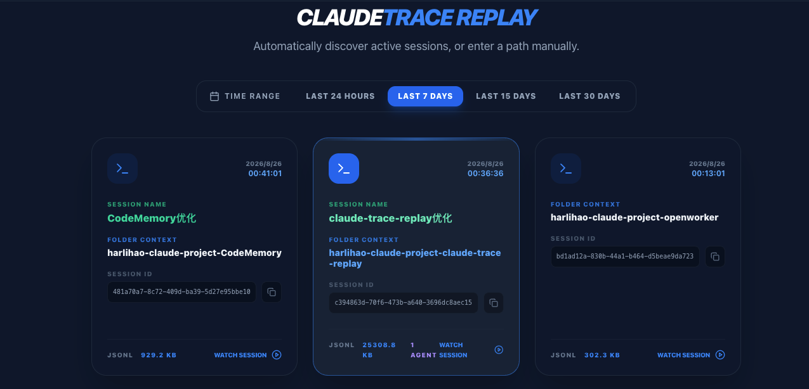
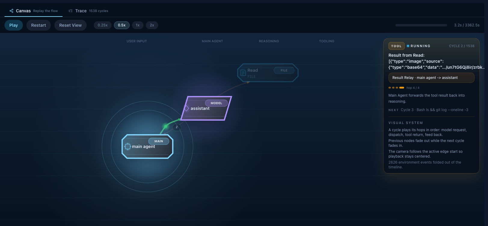
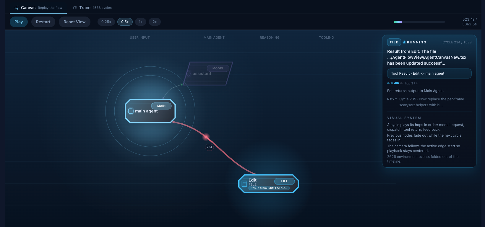
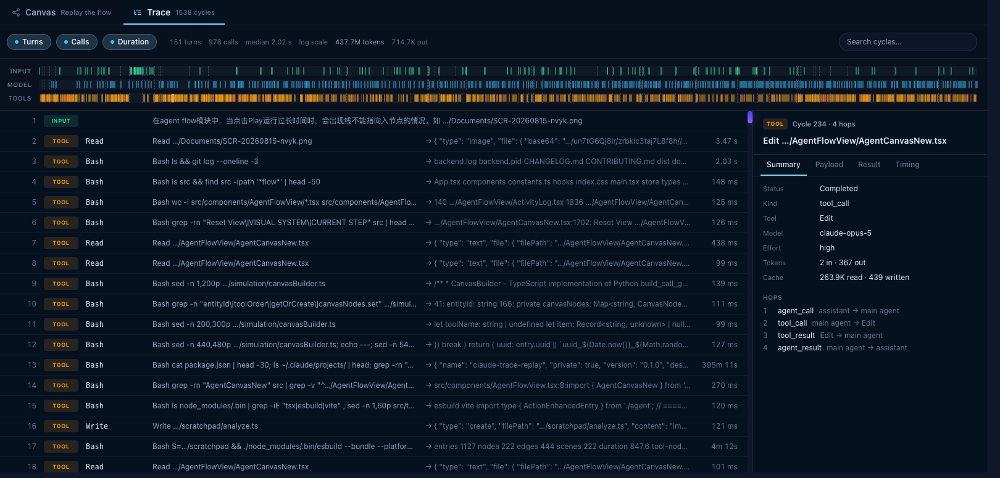
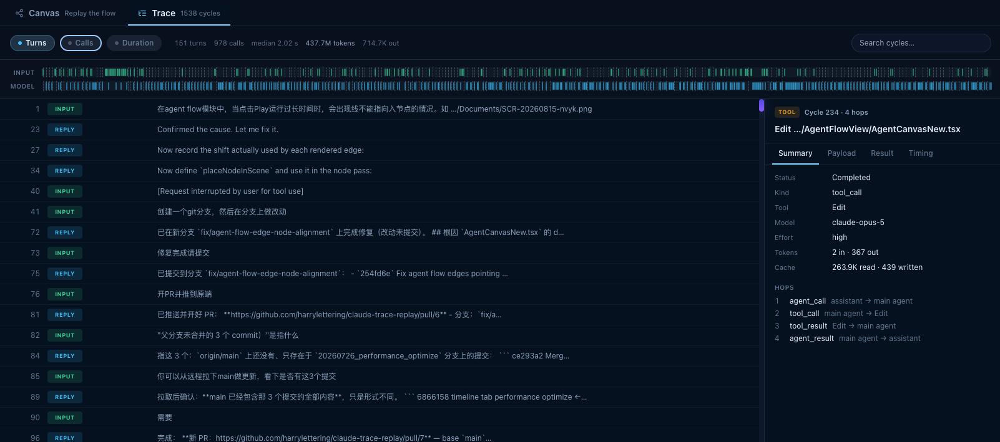
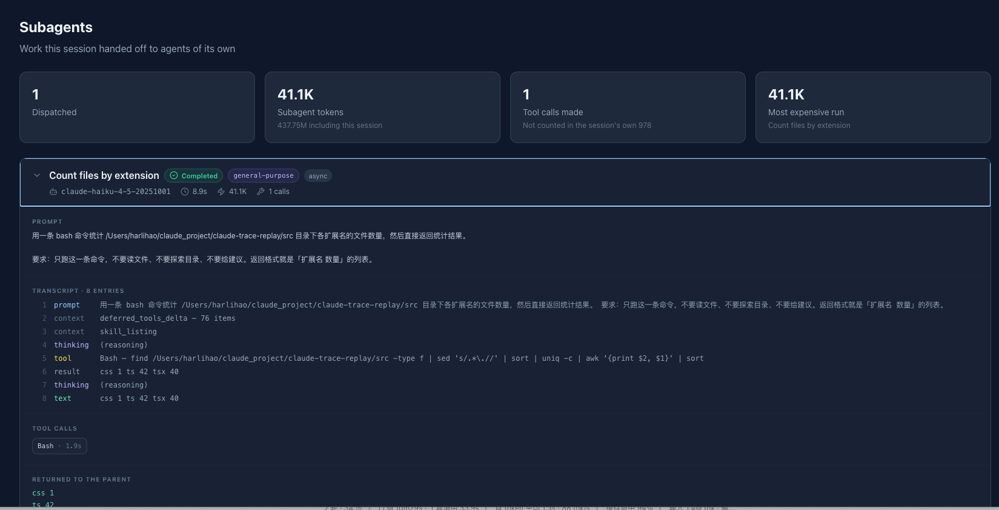
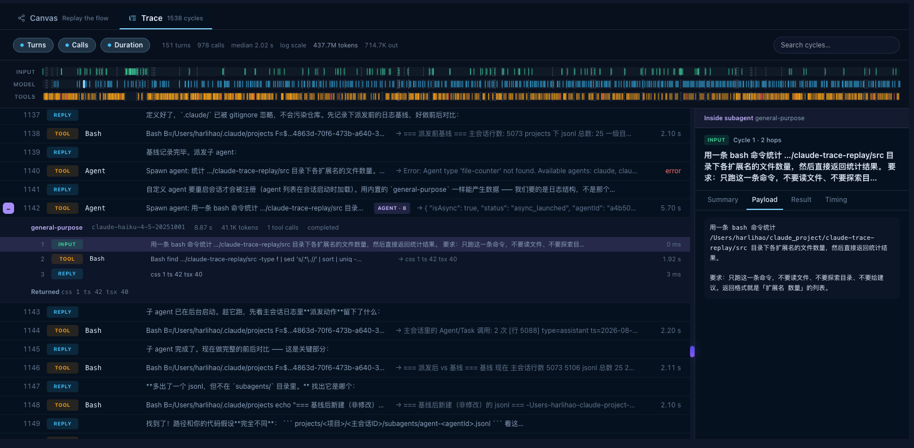
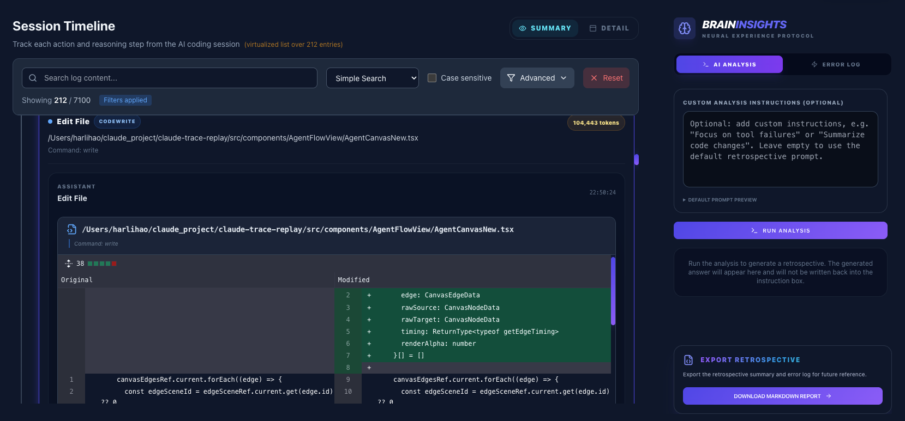
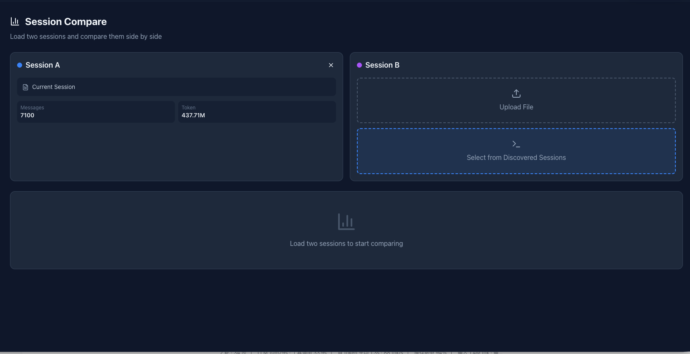

# Claude Trace Replay

[English](./README.md) | [简体中文](./README.zh-CN.md)

<p align="center">
  <strong>面向 Claude Code 的开源 trace viewer 与可观测性工作台。</strong>
</p>

<p align="center">
  把 Claude Code <code>.jsonl</code> traces 变成可回放、可分析的可视化工作台，用来查看 agent 流程、工具调用、token 波动、会话差异，以及一次运行里到底发生了什么。
</p>

<p align="center">
  <a href="https://github.com/harrylettering/claude-trace-replay/stargazers">GitHub Star</a>
  ·
  <a href="#demo">观看 Demo</a>
  ·
  <a href="#quick-start">快速开始</a>
  ·
  <a href="#use-cases">使用场景</a>
  ·
  <a href="#feature-highlights">核心能力</a>
  ·
  <a href="#screenshots">界面截图</a>
  ·
  <a href="#who-its-for">适合谁</a>
</p>

<p align="center">
  <a href="https://github.com/harrylettering/claude-trace-replay/stargazers"></a>
  
  
  
  
</p>


<a id="demo"></a>

## Demo

90 秒产品演示：

https://github.com/user-attachments/assets/be7374a6-5f6a-4c87-95f5-defe3974f6ea

## 一句话介绍

Claude Trace Replay 是一个面向 Claude Code 的开源 trace viewer，它把原始 `.jsonl` 会话变成可回放的调试、可观测性与 prompt 复盘工作台。

## 为什么值得关注

Claude Code 的 traces 信息量很大，但直接读原始 JSONL 通常既费眼也费脑。

Claude Trace Replay 会把原始会话日志变成可视化回放与调试空间，帮助你：

- 按顺序看清 agent 实际做了什么
- 找出哪些工具调用消耗了时间、token 和注意力
- 用回放方式理解 agent 与工具之间的交互，而不是硬啃原始事件块
- 对比两次会话，理解 prompt、模型或工作流到底哪里变了
- 在运行结束后复盘 prompt 质量和协作模式

如果你经常使用 Claude Code，它能帮你从“我抓到一份 trace”走到“我知道发生了什么”。

<a id="use-cases"></a>

## 使用场景

- **排查复杂 agent 运行**：快速定位哪一步开始变慢、打转或偏航
- **检查工具调用行为**：按执行顺序查看文件读取、diff、终端命令和工具结果
- **复盘 token 使用**：识别高消耗轮次和异常峰值，避免问题变成常态
- **对比 prompt 或模型调整**：看清为什么这次 Claude Code 会话比上次更好或更差
- **追踪派发出去的工作**：子 agent 做了什么不再停留在「agent 已启动」
- **向团队分享经验**：把难读的原始 trace 变成大家都能一起讨论的可视化工作台

<a id="feature-highlights"></a>

## 核心能力

- **Agent Flow · Canvas**：按时间顺序动态回放主 agent 与各工具之间的调用链
- **Agent Flow · Trace**：同一次运行的回合表，按真实耗时铺开，每个回合的入参、结果、hops 和时序都可检视
- **子 agent 可观测**：用 Task 派发的 agent 会读取它自己的日志，关联回派发它的那个回合，并可在 Trace 里就地展开
- **实时监听**：本地服务盯着 `~/.claude/projects`，正在进行的会话边写边进来 —— 包括会话中途才派发的 agent 的日志
- **Searchable Timeline**：检索工具调用、思考内容、diff、文件读取、终端命令和执行结果，可按条目类型、工具、时间范围和 token 区间筛选
- **Token Analytics**：input、output，以及缓存 token —— 长会话里几乎全部输入都走缓存计数，漏掉它总量会小两个数量级；用量按 API 响应计一次，而不是按日志条数
- **Session Compare**：对比两次运行中的消息、token、工具和模型差异
- **AI Retrospective**：把压缩后的 trace 交给本地 Claude CLI，生成优点、问题和改进建议

<a id="who-its-for"></a>

## 适合谁

- 需要排查复杂 Claude Code 会话的开发者
- 需要复盘长链路 agent 运行过程的人
- 想理解为什么某个 prompt 或工作流效果更好的团队
- 想从真实 AI 编码 traces 中总结经验的人

<a id="screenshots"></a>

## 界面截图

### 找到一个会话

`~/.claude/projects` 下的会话会被自动发现。标着 `1 AGENT` 的卡片派发过子 agent，
意味着旁边还有一份可以打开的子 agent 日志。



### Agent Flow · Canvas

一次一个回合：模型发起、harness 派发、工具返回、结果回灌。右侧面板会说明当前处在哪一跳、
下一步是什么。

| 工具结果正在回到 agent | 一次文件编辑进行中 |
| --- | --- |
|  |  |

### Agent Flow · Trace

同一次运行的表格形态。顶部三条轨道把每个回合按真实耗时铺开；`Turns` 和 `Calls`
控制折叠掉多少内容。选中一个回合就能看它的入参、结果、hops 和时序。

| 全部回合，按耗时缩放 | 折叠到对话轮次 |
| --- | --- |
|  |  |

### Subagents

派发出去的工作会被完整跟到底：收到什么任务、做了什么、花了多少、返回了什么。
Trace 里的派发行可以就地展开成那个 agent 自己的轨迹，用同一个面板检视。

| Subagents 视图 | 在 Trace 中就地展开的派发 |
| --- | --- |
|  |  |

### 会话洞察

| Session Overview | Token Usage |
| --- | --- |
|  |  |

| Timeline 与复盘面板 | Session Compare |
| --- | --- |
|  |  |

## Quick Start

准备一份你自己的 Claude Code `.jsonl` trace，几分钟内就能在本地跑起来。

### 环境要求

- Node.js 20.19+ —— 实时监听用的 `chokidar` 5 要求这个版本。CI 用 Node 22 构建。
- npm

### 安装

```bash
git clone https://github.com/harrylettering/claude-trace-replay.git
cd claude-trace-replay
npm install
```

### 运行

```bash
./start.sh
```

打开 `http://localhost:3000`。

`start.sh` 会起两个进程：3000 端口的 Vite 开发服务器，和 4000 端口的本地监听服务
（`server.cjs`）。后者负责扫描 `~/.claude/projects` 里最近的会话、把正在进行的会话
边写边推给前端，以及在 Retrospective 视图里调用你本地的 `claude` CLI。数据不出本机；
不启动监听服务也能用，手动上传 `.jsonl` 即可 —— 只是没有自动发现和实时监听。

### 构建

```bash
npm run build
```

### 预览生产构建

```bash
npm run preview
```

## 首次使用

1. 在本地打开应用。
2. 加载一份 Claude Code `.jsonl` trace。
3. 在 timeline、token、flow、compare 和 analysis 视图之间切换。
4. 找出运行变慢、变乱或偏航的具体步骤。

提示：如果你准备分享这个项目，用真实 trace 录一段前后对比短视频，通常比单纯放截图更容易让别人秒懂价值。

## Workspace Views

下面就是左侧导航里的条目，顺序一致。

| 视图 | 你能看到什么 |
| --- | --- |
| Agent Flow | 同一条时间轴的两个标签页：**Canvas** 回放 user、主 agent、assistant 与工具之间的交接；**Trace** 按真实耗时列出每个回合，并可逐个检视 |
| Session Overview | token、消息数、模型、时长和工具的整体统计 |
| Subagents | 每个被派发的 agent 收到什么任务、做了什么、跑了多久、花了多少、返回了什么 |
| Retrospective | 由本地 Claude CLI 生成的复盘结论与 prompt 质量建议 |
| Session Compare | 对比两次运行的差异 |
| Token Stats | 查看 token 峰值、高成本轮次和趋势变化 |
| Timeline | 按时间顺序查看操作、工具使用、diff 和结果 |
| Conversation Flow | 查看会话原始的 `uuid`/`parentUuid` 结构 |

## 为什么会做这个项目

Claude Code 会话往往很长、工具很多，只看原始 trace 数据很难复盘。

这个项目就是为了让这些会话更容易被理解和复查：

- 用于调试
- 用于性能优化
- 用于 prompt 迭代
- 用于 agent 工作流学习
- 用于和他人分享、对比运行结果

## 支持的 Trace 数据

Claude Trace Replay 主要围绕 Claude Code `.jsonl` 会话 traces 构建。

常见条目类型包括：

- `user`
- `assistant`
- `system`
- tool-use 和 tool-result 内容块
- permission 和 metadata 事件
- 文件历史快照

解析器会使用的一些常见字段包括：

- `uuid`
- `parentUuid`
- `timestamp`
- `type`
- `message` —— 其中的 `message.id` 标识这条 entry 来自哪次 API 响应。一次响应会按
  内容块拆成多条 entry，它们共享同一个 id 并各自重复携带同一份 `usage`，所以任何按
  响应求和的统计都必须按它分组。
- `isSidechain`
- `isMeta`
- `agentId` / `attributionAgent` —— 出现在子 agent 的日志里
- `toolUseResult` —— 其中的 `agentId` 是把一次 Task 回合和它启动的那次运行连起来的唯一线索

### 子 agent 日志

用 Task 工具派发的 agent 会写自己的文件，位置在会话文件下一层：

```text
~/.claude/projects/<project>/<sessionId>/subagents/agent-<agentId>.jsonl
```

这些条目是一段独立的对话、有自己的根节点，所以它们不进主会话的条目列表，而是按
`agentId` 归属到对应的 agent。自动发现会找到它们，实时监听会推送它们，Subagents 和
Trace 视图会读它们。只打开会话文件本身仍能看到「发生过一次派发」—— 只是没有可展开的
日志，界面会直说这一点。

## 技术栈

前端：

- React 18、TypeScript 5、Vite 5
- Tailwind CSS 3
- Recharts、XYFlow / React Flow、Framer Motion
- Lucide React、react-markdown、react-diff-viewer-continued
- Zustand、html2canvas

本地监听服务（`server.cjs`）：

- Express 5 与 `ws` —— HTTP 做发现，WebSocket 做日志推送
- chokidar 5 —— 文件监听

Agent Flow 的画布是用 Canvas 2D API 画的，没有用图布局库；React Flow 用在别处。

## 项目结构

```text
claude-trace-replay/
├── .github/workflows/ci.yml  # 每个 PR 上做类型检查与构建
├── docs/
│   └── screenshots/          # README 媒体资源和产品截图
├── src/
│   ├── components/
│   │   ├── AgentFlowView/    # Canvas + Trace：建图、回放、检查器
│   │   └── ...               # Overview、Subagents、Timeline、Compare、Retrospective
│   ├── hooks/                # 回放和交互 hooks
│   ├── types/                # 领域类型
│   ├── utils/                # Trace 解析、分析和辅助工具
│   ├── App.tsx               # 应用壳层与导航
│   ├── main.tsx              # 入口文件
│   └── index.css             # 全局样式
├── server.cjs                # 本地监听服务：发现、实时推送、CLI 分析
├── start.sh                  # 同时拉起监听服务和开发服务器
├── package.json
└── README.md
```

## 开发

```bash
npm run dev       # 启动 Vite 开发服务器（仅前端）
npm run build     # 类型检查并构建生产包
npm run preview   # 本地预览生产构建
node server.cjs   # 单独启动监听服务，端口 4000
```

`npm run lint` 虽然定义了但目前跑不起来：仓库装了 ESLint 却没有配置文件，执行会以
`couldn't find a configuration file` 退出。CI 在每个 PR 上跑 `npm ci && npm run build`
（完整的类型检查与构建）。补一份 ESLint 配置是很合适的第一个贡献。

### 改解析器时怎么验证

解析器是这个项目里最容易「悄悄算错」的部分 —— 一个错的数字照样能渲染出来。改它的时候，
请**独立算出期望值**：直接从原始 `.jsonl` 出发，走一条和被测代码不同的推导路径，再逐项比对。
如果期望值和代码用的是同一套假设，那次比对什么都没验证，只证明了你前后一致地错着 ——
这在本项目里真实发生过，提交历史里有记录。

## Roadmap

- 加入匿名 sample traces，方便第一次使用的人直接探索
- 在 Agent Flow 画布上画出子 agent —— 需要给图模型加一条 agent 泳道，所以目前子 agent
  在 Trace 和 Subagents 视图里可见，画布上还没有
- 给剩下的无上限列表加虚拟化；Conversation Flow 会把每个节点都渲染出来，大会话下最吃亏
- 补一份 ESLint 配置让 `npm run lint` 能用，并接进 CI
- 把失败、重试、重复命令这类信号做成主动呈现的「发现」，而不是靠人眼去看
- 增加导出报告和复盘结果的预设

## Contributing

欢迎贡献。

适合参与的方向包括：

- parser 改进
- UI 打磨
- 大体量 traces 的性能优化
- 新的分析面板
- 示例数据集和可复现问题样例

如果这个项目帮你更快理解 Claude Code 会话，欢迎点一个 GitHub Star，让更多人看到它。

## License

MIT
